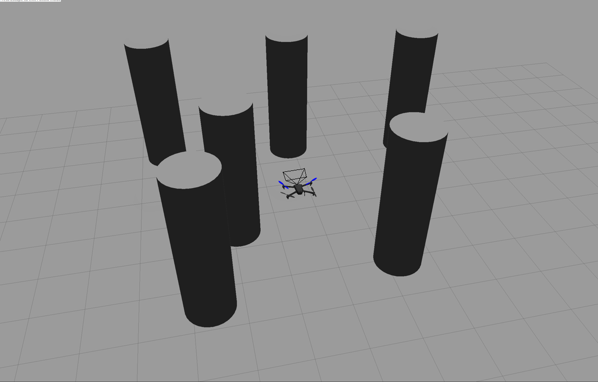
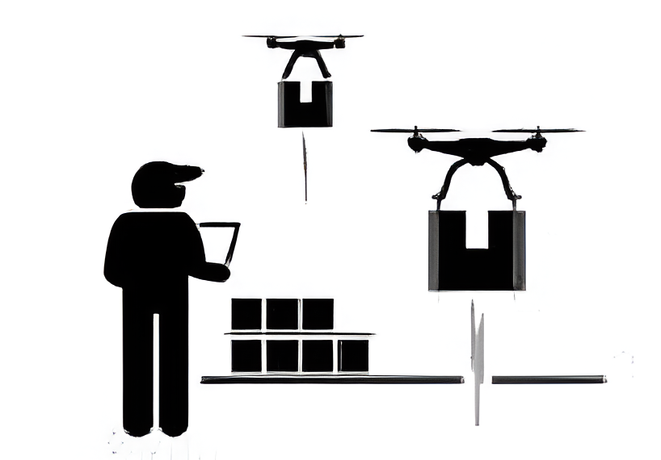
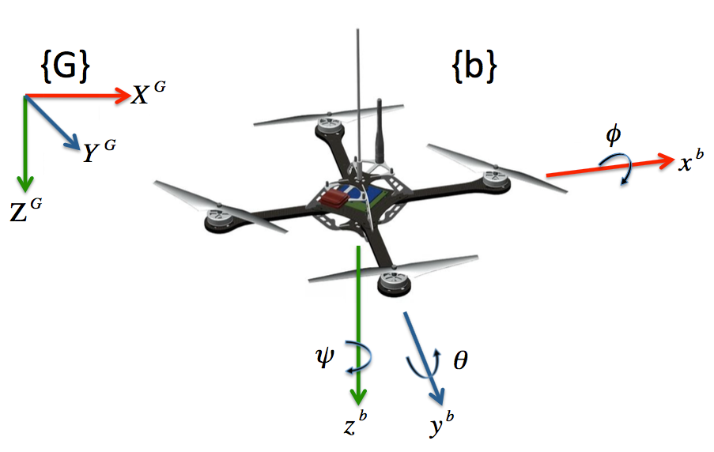
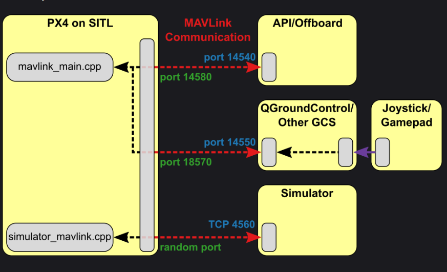
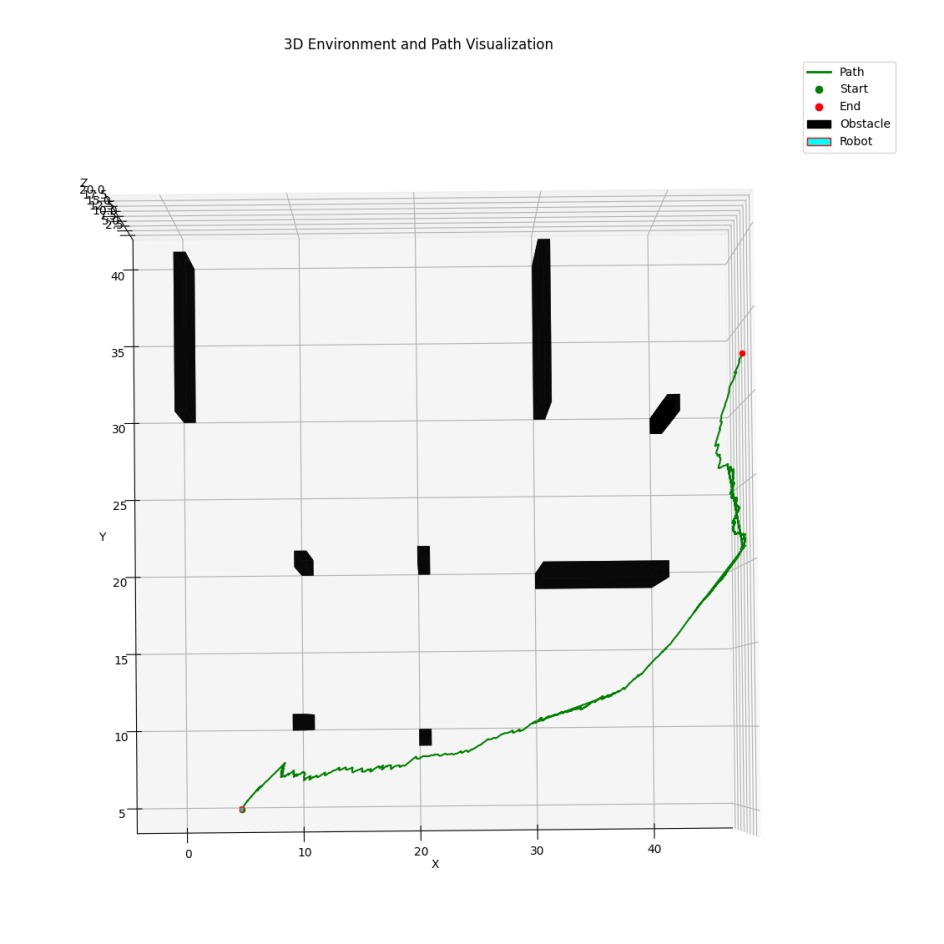
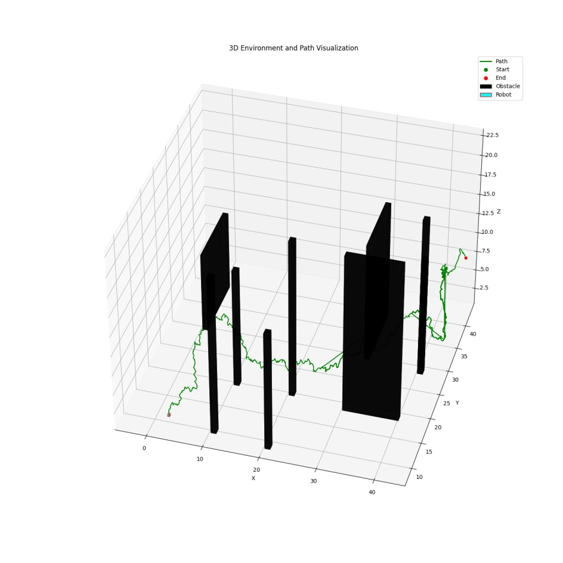
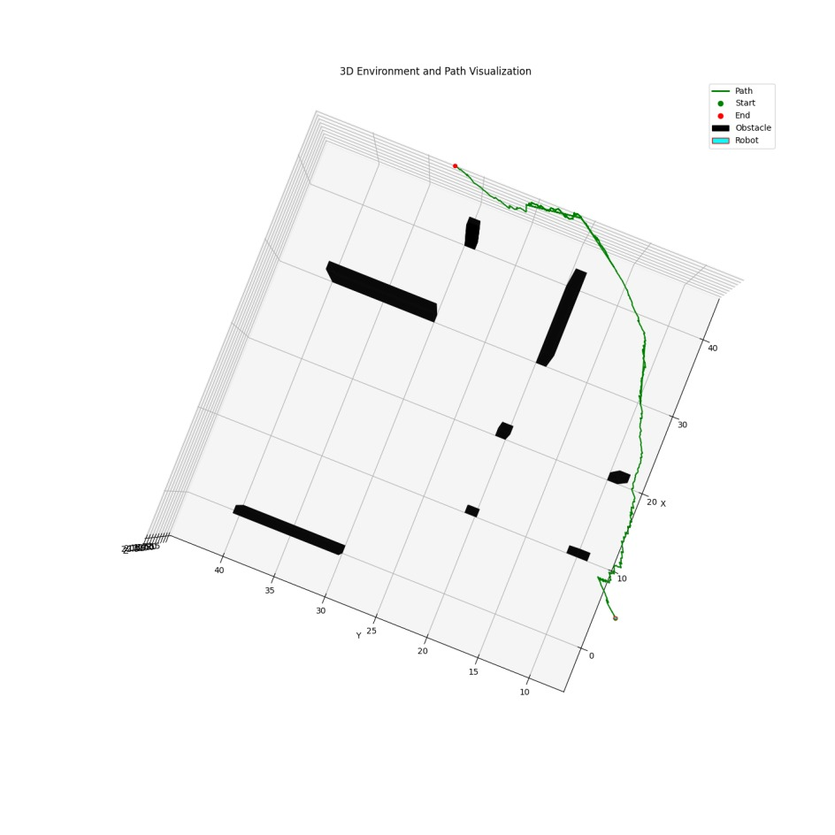
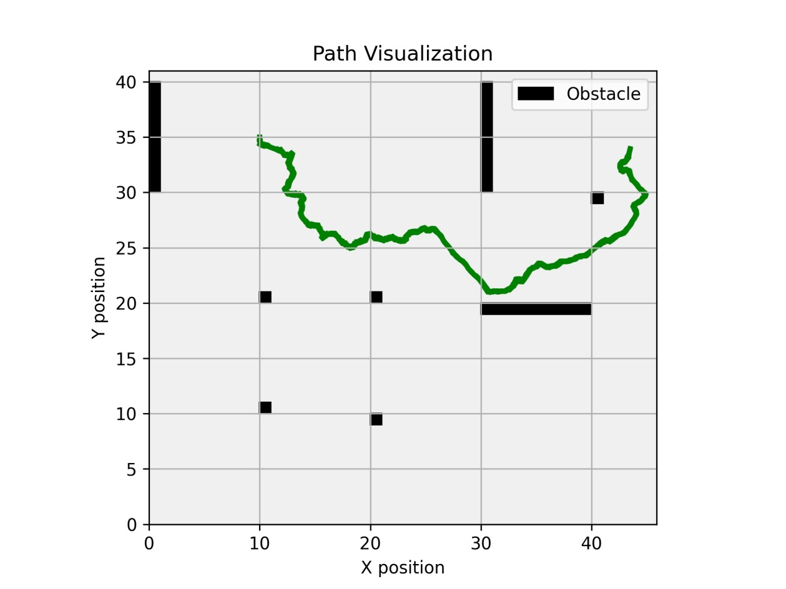
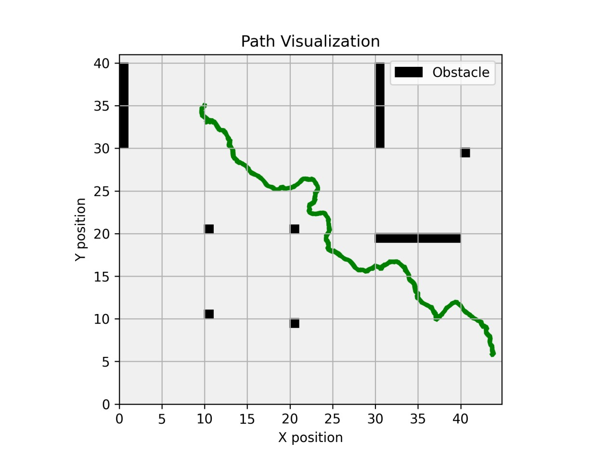
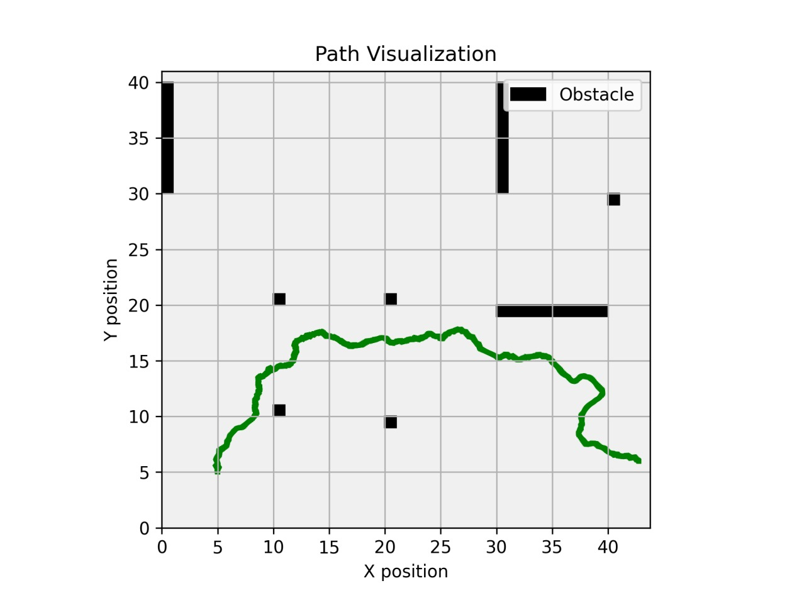

<div align="center">
  
# Real-Time Obstacle Avoidance and Path Planning for Drones
### Kinodynamic Constraints in Unknown Environments

[](#)
[](#)
[](#)
[](#)

*An advanced software simulation project focused on real-time mapping, kinodynamic path planning, and autonomous drone navigation using PX4 and FastPlanner.*

</div>

---

## 📖 Overview

Real-time obstacle avoidance in unknown environments is a highly complex task. This project implements a fully simulated environment that achieves robust aerial navigation leveraging dense occupancy mapping, Euclidean distance models for collision checking, and kinodynamic planning via an enhanced RRT methodology. 

### Why this approach?
Operating in unknown environments requires continuous, fast, and probabilistic computational models to guarantee safety and efficiency without compromising flight dynamics. We combined **Octomap** for reliable probabilistic 3D representation and a custom bounding box **RRT method** to respect kinodynamic constraints (such as the near hover condition).

---

## 🧩 Key Modules

### 1. Dense Mapping (Octomap)
The drone perceives its unknown surroundings and constructs a **Probabilistic Occupancy Map** in real-time. The 3D space is partitioned into voxels. 
- Point clouds are simulated from depth sensors (e.g., RealSense profiles).
- The map robustly updates based on sensor thresholds, overcoming zero-mean Gaussian noise.

<p align="center">
  
  
</p>
<p align="center"><em>Octomap Grid and Dense Mapping Visualization</em></p>

### 2. Collision Check (Euclidean Distance Map)
Probabilities aren't enough for safe navigation bounds. We utilize the **EDT3D Library** to generate a fixed-size Euclidean distance map around the drone.
- Provides discrete clearance values from the nearest obstacles.
- Continuous real-time updates based on movement threshold (1 meter).

<p align="center">
  
</p>

### 3. Kinodynamic Planning (RRT Method)
Our custom planner calculates traversable routes strictly respecting physical bounds (`STEPSIZE`) and structural velocity limits.
- The path generated avoids obstacles and abides by the **Near Hover Condition**.
- Allows rapid computation of dynamic nodes to ensure safe trajectory bounds.

<p align="center">
  
</p>
<p align="center"><em>Step-by-step Execution of our Custom RRT Methodology</em></p>

### 4. Control (PX4 Autopilot)
Trajectory generated by the RRT planner is directly executed using the **PX4 Autopilot** firmware completely in **Gazebo Simulation**. 
- Traversal via Offboard position control.
- `mavros` passes high-fidelity waypoints to the simulated Pixhawk flight controller.

<p align="center">
  
</p>
<p align="center"><em>Gazebo Simulation Environment</em></p>

---

## 📈 Evaluation and Results

Our planner underwent continuous evaluation checking step size modifications (`0.2`, `0.5`, `1.0`), plotting 2D and 3D paths for accuracy and subpath generation efficiency. 

#### 3D Path Simulation Views

<p align="center">
   
  
  
</p>

#### 2D Path Evaluations

<p align="center">
   
  
  
</p>

---

## ⚙️ Installation and Execution (Simulation Only)

**Tested Environment:** ROS Melodic (Ubuntu 18.04 / 20.04 via Docker)

### 1. Dependencies Setup
Install essential mapping tools, point-cloud configurations, and PX4 environment prerequisites:
```bash
sudo apt-get install ros-$DISTRO-octomap-* ros-$DISTRO-pcl-ros ros-$DISTRO-mavros ros-$DISTRO-mavros-extras libeigen3-dev

# Octomap compilation (For DynamicEDT3D)
git clone https://github.com/OctoMap/octomap
cd octomap && mkdir build && cd build
cmake .. && make && sudo make install

# Setup Mavros Geographic Libs
wget https://raw.githubusercontent.com/mavlink/mavros/master/mavros/scripts/install_geographiclib_datasets.sh
sudo bash ./install_geographiclib_datasets.sh   
```

### 2. Building the Package
```bash
mkdir -p catkin_ws/src && cd catkin_ws/src
git clone https://github.com/ShreyasKhobragade/Motion-Planning-for-Drones-in-Unknown-Environment.git FastPlannerOctomap
cd ..
catkin_make
source devel/setup.bash
```

### 3. Running the Simulation
Execute the mapping, planning, and controller modules across multiple terminals:

- **Terminal 1 (Gazebo SITL):** 
  ```bash
  cd PX4-Autopilot && sudo no_sim=1 make px4_sitl_gazebo
  ```
- **Terminal 2 (Environment Launch):** 
  ```bash
  cd PX4-Autopilot && source Tools/setup_gazebo.bash $(pwd) $(pwd)/build/px4_sitl_default
  roslaunch gazebo_ros empty_world.launch
  # Inside Gazebo, insert 'iris_depth_camera' from the left panel.
  ```
- **Terminal 3 (Mapping Node):** 
  ```bash
  cd catkin_ws && source devel/setup.bash
  roslaunch FastPlannerOctomap MappingSim.launch
  ```
- **Terminal 4 (Planner):** 
  ```bash
  rosrun FastPlannerOctomap Planner
  # Follow terminal prompts to define Goal heights and parameters
  ```
- **Terminal 5 (Controller):** 
  ```bash
  rosrun FastPlannerOctomap Controller
  ```

*A 2D Nav Goal can be assigned dynamically within RViz (launched alongside mapping).*

---
<p align="center"><em>Project created and maintained by Dhruv Agrawal, Hrishikesh Pawar, and Shreyas Khobragade</em></p>
